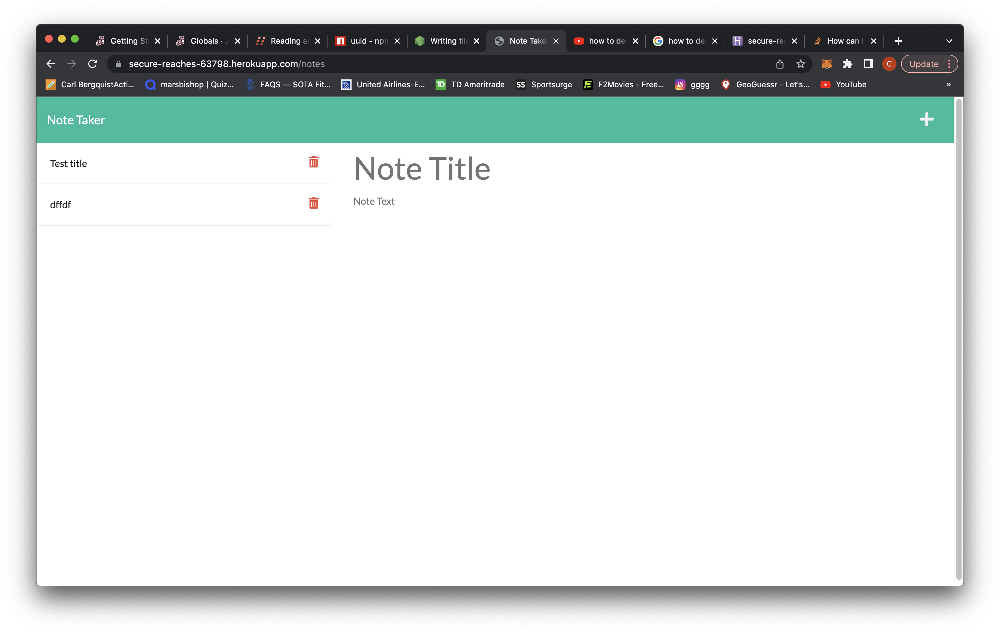

# Note-Taker

## Description

For this HW assignment we were required to add the correct routes so that the pages would load and work correctly. Aswell as routing modules together so that server could properaly read everything. 

## Table of Contents

[Description](#description)
[Installation](#installation)
[Usage](#usage)
[License](#license)
[Contributing](#contributing)
[Screenshot](#screenshot)
[Link](#Link)
[Questions](#questions)

## Installation

Go to the link at the bottom of the page and run it.

## Usage

When a new note is made you can save it and it will appear on the left hand column, you are also able to click your previously made notes.

## Contributing

Carl Bergquist

## Screenshot

## Link

https://secure-reaches-63798.herokuapp.com/

## Questions

Link to my [GitHub](https://github.com/CarlBergquist/)

If you have any further questions please email me at: carlbergquist81@gmail.com

